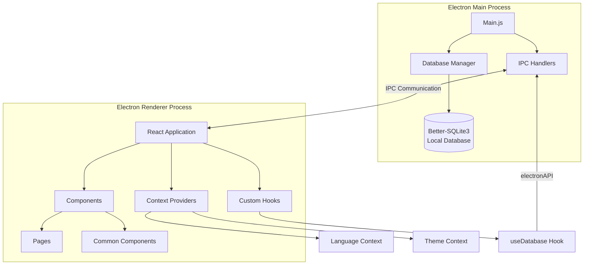
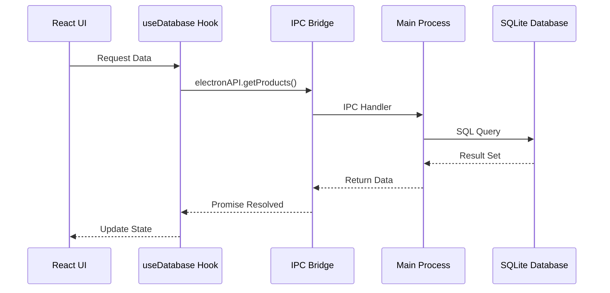
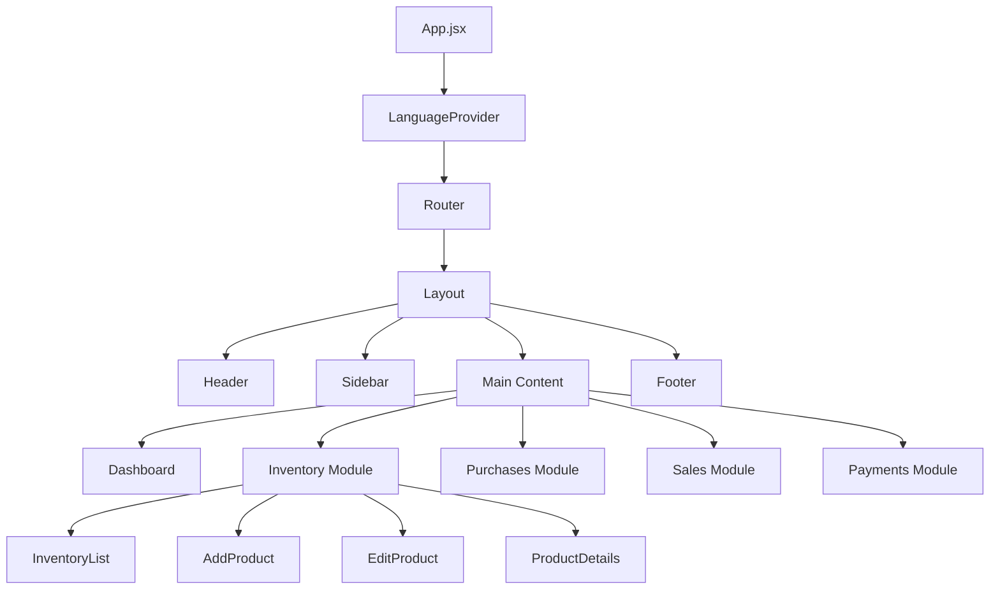
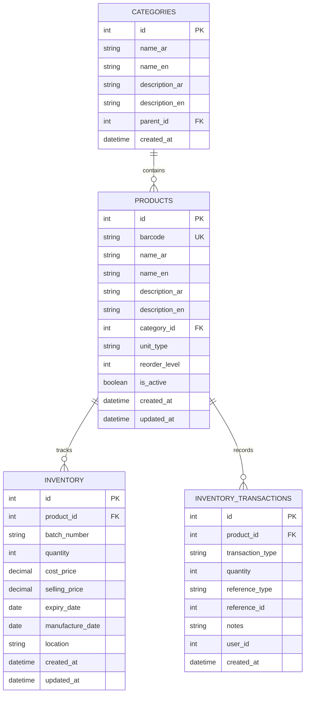
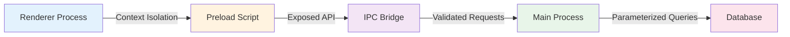
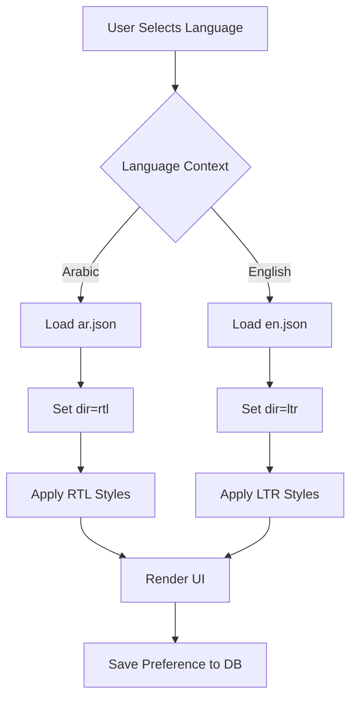
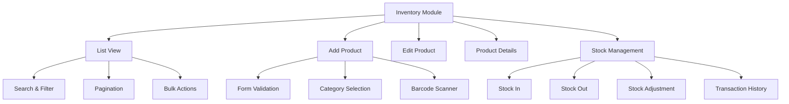
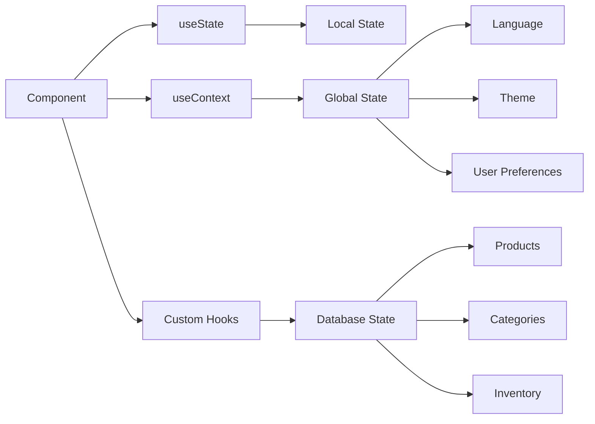
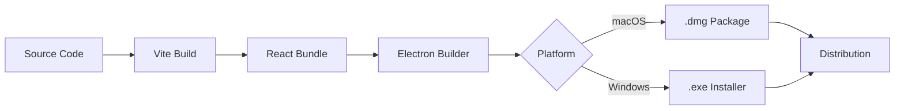
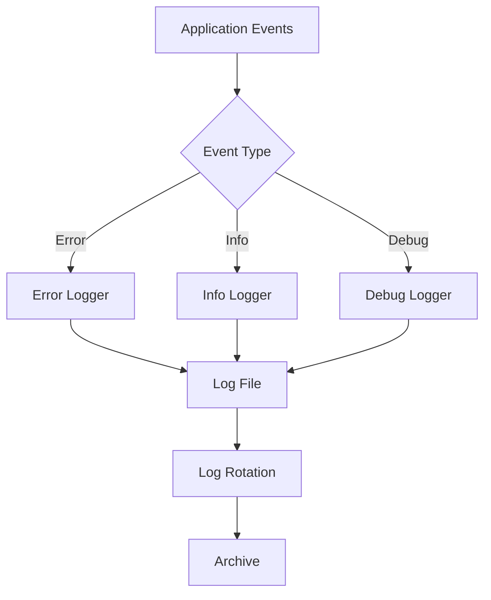

# PharmaTech - System Architecture

---

## 🏗️ High-Level Architecture

---

## 🔄 Data Flow Architecture

---

## 📦 Component Hierarchy

---

## 🗄️ Database Schema Relationships

---

## 🔐 Security Architecture

### Security Layers

1. **Context Isolation**: Renderer process cannot directly access Node.js APIs
2. **Preload Script**: Whitelist-only API exposure via `contextBridge`
3. **IPC Validation**: All requests validated before processing
4. **Parameterized Queries**: SQL injection prevention
5. **Local Storage**: Database stored in secure user data directory

---

## 🌐 Internationalization Flow

---

## 📱 Module Structure

### Inventory Management Module

---

## 🔄 State Management

---

## 🚀 Build & Deployment Pipeline

---

## 📊 Performance Optimization Strategy

### Database Optimization
- **Indexing**: Create indexes on frequently queried columns
- **WAL Mode**: Write-Ahead Logging for better concurrency
- **Prepared Statements**: Reuse compiled SQL statements
- **Batch Operations**: Group multiple operations in transactions

### UI Optimization
- **Code Splitting**: Lazy load routes and components
- **Memoization**: Use React.memo for expensive components
- **Virtual Scrolling**: For large lists (inventory, transactions)
- **Debouncing**: Search and filter operations

### Memory Management
- **Database Connection**: Single persistent connection
- **Resource Cleanup**: Proper cleanup in useEffect hooks
- **Image Optimization**: Compress and cache product images

---

## 🔍 Monitoring & Logging

---

## 🧪 Testing Strategy

### Unit Tests
- Database operations
- Utility functions
- Validation logic
- Component logic

### Integration Tests
- IPC communication
- Database transactions
- Component interactions
- Form submissions

### E2E Tests
- User workflows
- Module navigation
- Data persistence
- Language switching

---

## 📈 Scalability Considerations

### Current Architecture (Phase 1)
- Single-user desktop application
- Local SQLite database
- Offline-first approach

### Future Enhancements
- Multi-user support with user authentication
- Cloud sync capabilities
- Real-time updates across devices
- Mobile companion app
- API for third-party integrations

---

## 🔧 Technology Stack Details

| Layer | Technology | Version | Purpose |
|-------|-----------|---------|---------|
| Desktop Framework | Electron | Latest | Cross-platform desktop app |
| UI Framework | React | 18.x | Component-based UI |
| Build Tool | Vite | Latest | Fast development and building |
| Database | Better-SQLite3 | Latest | Local data storage |
| Routing | React Router | 6.x | Client-side navigation |
| Internationalization | i18next | Latest | Multi-language support |
| Styling | CSS3 | - | Custom styling with RTL support |

---

## 🎯 Design Principles

1. **Offline-First**: Application works without internet connection
2. **Bilingual**: Full Arabic and English support with RTL
3. **User-Friendly**: Intuitive interface for pharmacy staff
4. **Secure**: Local data storage with proper validation
5. **Performant**: Fast operations even with large datasets
6. **Maintainable**: Clean code structure and documentation
7. **Extensible**: Easy to add new modules and features

---

**Document Version:** 1.0  
**Last Updated:** 2026-06-30